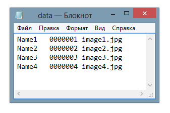
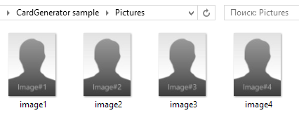
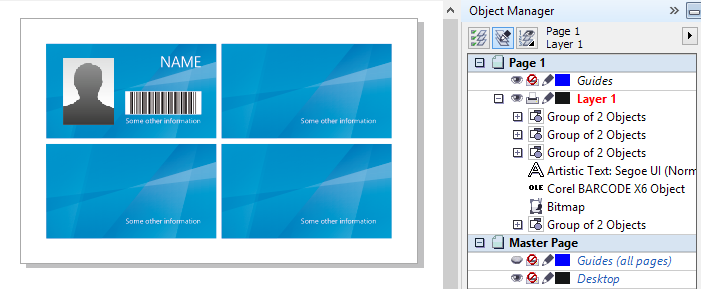
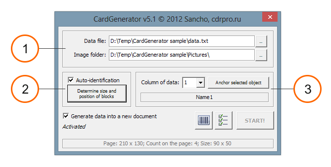
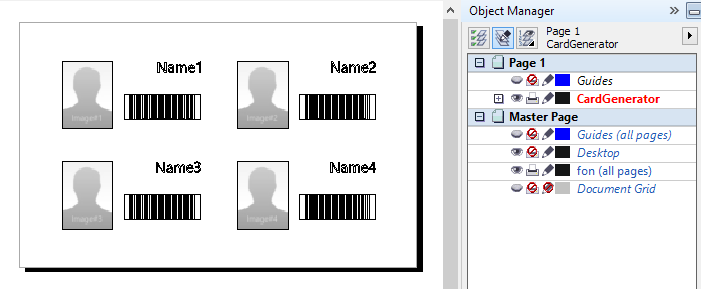
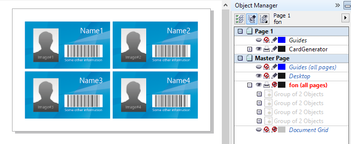

# How it Works

[Sample GIF video](./assets/video-sample.gif) (2.3Mb)

For example, let's make cards for 100 staff members of a company. On each card they will have a name, bar code and picture (unique for each staff member).

Usually the client will provide the information to you in an Excel file, with a model of one card. That's all we need in order to proceed.

First, export data from Excel into a text file. For this, after opening table into Excel, we select the command “to preserve as…” and as the type of file we indicate “text files" (tab delimited). After saving, open the text file and verify the result.

 

Open the template in CorelDRAW. Arrange the cards as needed using the transformation docker. Important: variable data (bar code, name, image) must be in the upper left card only. It will serve as a template tag. You should have something similar:

Let's try the CardGenerator macro. We start macro with the aid of the command cardGen.StartCardGenerator.

1. The first thing we need, indicate from which Tab-delimited text file the macro must to take the data. All variable data is taken from that file. And specify the folder where the macro have to find pictures (in this case, the file names must be specified in the data file).

2. Select the background rectangles (easier by pressing ALT and touching shapes with pick tool) and then press the 'Determine size and position of blocks'. If you correctly made the selection, the macro will show us the size of our sheet, what quantity of cards is arranged on one sheet, and then, the size of one card. Data is indicated in the units of the measurement for this document.   
Note: all cards must be the same size!

3. Next, you need to specify which column of the data and which object must to bind by the macro. This is one of the innovations of version 5 of the macro, which eliminates several limitations. For example, you can do not to comply with the order of columns in the data file, and do not even need to use all the columns. You are perfectly free to choose in which order and which columns are bound to data in the document.

So, in order to indicate to the macro, what data and in what form it should create them, do the following (for example, the first column):

1. Select the text object "Name" in the document with the tool Pick tool.
2. Choose from the list 'Column of data' the first column. In the box below the macro displays the first line of this column, and if you click on it will show the first ten lines.
3. Press the button 'Anchor selected object'.

In this case the macro will memorize all necessary formulation and position relative to card, and so it will report that first data are successfully preserved.

Agree, it's very simple and clear: select the object, select the column of data, and the "ask" macro remember. And same with any type of data, be it a picture, line, paragraph text or bar code.

So that the macro know what settings to use for the barcode, you must click on the bar code icon. After clicking it opens the standard Windows barcode Wizard. Select the type (in our case CodaBar), the number can be anything you want, because it may not affect anything. Use the «Next», enter all the necessary settings at all stages and in the end, click «Finish» to confirm the settings and close the wizard.

Everything's ready! Click "Start" and wait for the macro to finish.

As shown in the picture above, took the macro data from the file and placed them according to our previous settings. If you have a lot of data and results are too many to fit on one page, the macro will add pages as needed.

More details: As you probably understood, it's necessary to create a template for the macro. The macro memorizes the size of the sheet, such as size has a block, and as blocks they are arranged on the sheet based on the template.

That the macro allows up to 7 variable data fields per block.
Block: a rectangle, inside which are variable data for one card. In the example above, we used a background rectangle of a card as one block.

It is important that the facility-tags were in the first allocated block only. If the option 'Auto-identification' is enabled, the first block will be the top left of the selected. In general, the order of allocation of blocks is very important - variable data will be established in that order. If the option 'Auto-identification', the macro will automatically remember the order of blocks (from left to right and top to bottom).
