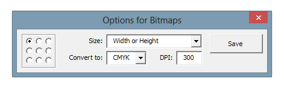

# Images Settings

When you specify an image, the macro further asks you exactly which settings to use:

The left side of the window select the reference point - relative to any corner of the image, it will even out.

In the 'Size' field the following options:

* Original - the original size of the image
* Width - fit (proportionally) to the width of the image tag
* Height - fit (proportionally) the height of the image tag
* Both - customized (disproportionate) to the width and height of the image tag
* Width or Height – fit (proportionally) in the size of the image tag

In the 'Convert to' drop-down list need to tell what color mode to convert an image after insertion. And in the 'DPI' field, specify which dpi a given image after insertion.
