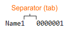
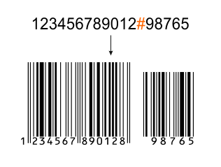

# The macro's settings

Separators - special symbols, which divide line into separate data.   
That to understand what separators are, it is necessary to turn to example described above. Thus, we know that one line - one data set. We so remember that preserving data from Excel, we used type “text files (with the separators of tabulation)”. So here, the data inside the line are divided by the unprintable symbol of tabulation.

The keyword 'tab' in the macro, is equivalent to the symbol of tabulation.   
The second separator will be required if and only if bar code will contain two values, for example as on the image below.

Other settings:

* Insert bar code as a vector. If the option is a bar code is inserted as a group of vector objects. Number bar code, if there is, is inserted as a font. If you disable this option, the bar code will be inserted in the document as an OLE-object.
* Convert barcodes in CMYK. The option works only if the bar code is inserted as a group of vector objects.
* Remove white background barcode. The option works only if the bar code is inserted as a group of vector objects.
* Put barcodes in PowerClip.
* Use disable repainting. If you enable this option, the macro works faster.
* Hide macro during processing . The macro uses a standard wizard barcodes. Therefore, it will quickly appear and disappear on the screen while the macro. If you do not like it, you can activate this option, and then at the time, the window CorelDRAW will override all other windows.
* Delay Time for barcode generation. To change this setting should be taken very carefully! Its essence is that after the macro specifies a master bar code to create, it needs a certain number of time to create. By default this time is half a second.
